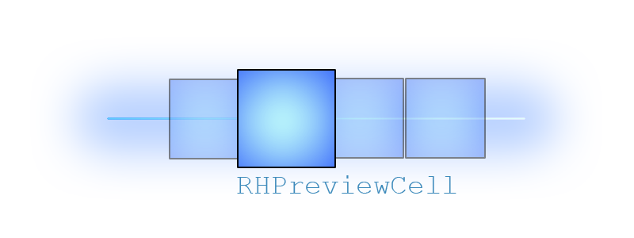
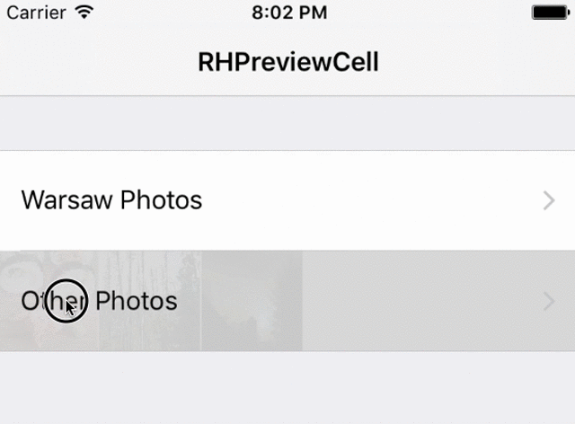
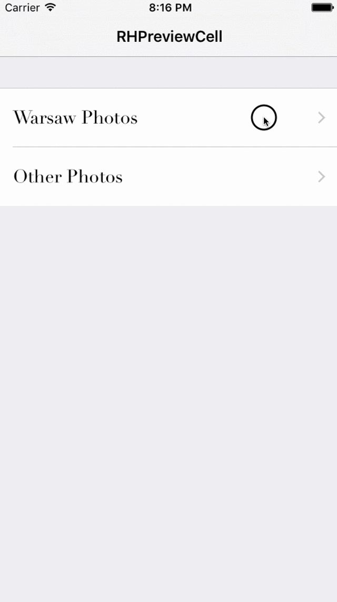

[](http://cocoadocs.org/docsets/RHPreviewCell)
[](/LICENSE)
[](https://developer.apple.com/iphone/index.action)
[](https://developer.apple.com/swift)

# RHPreviewCell 🌶
I envied so much Spotify iOS app this great playlist preview cell 😍, I decided to create my own one 🌶. Now you can give your users ability to quick check "what content is hidden under your UITableViewCell". Great think is that this Library not requires 3D Touch support from user device💥.

## Play with it 😎
<p align="center">

</p>

## Installation
You can install RHPreviewCell library using Cocoapods:
```
pod 'RHPreviewCell'
```
or you can simply copy ```RHPreviewCellSource``` folder to your project.

## Usage
To fully integrate RHPreviewCell with your Table View you just need to use RHPreviewCell like normal UITableViewCell in terms of your TableView data source 'cellForRowAtIndexPath' method.

```swift
func tableView(tableView: UITableView, cellForRowAtIndexPath indexPath: NSIndexPath) -> UITableViewCell {
    // Fetching already registered RHPreviewTableViewCell
    let cell = tableView.dequeueReusableCellWithIdentifier(reuseCellIdentifier) as! RHPreviewTableViewCell

    // Delegate using which, tiles will talk to your class
    cell.delegate = self
    // Data source for feed small tiles 🚼
    cell.dataSource = self

    return cell
}
```
💡 Important thing is that your View Controller needs to comform to ``` RHPreviewCellDataSource```  and ``` RHPreviewCellDelegate```  protocols. In that way you will be able to provide all neccesary data for ``` RHPreviewTalveViewCell```  tiles.

### RHPreviewCellDataSource
```swift
func previewCellNumberOfTiles(cell: RHPreviewTableViewCell) -> Int
func previewCell(cell: RHPreviewTableViewCell, tileForIndex: Int) -> RHPreviewTileView
```

### RHPreviewCellDelegate
```swift
func previewCell(cell: RHPreviewTableViewCell, didSelectTileAtIndex indexValue: RHTappedTileIndexValue)
```
And thats it! 💥  You have already integrete Library with your Table View 🎉

<p align="center">

</p>

## Implementation hint from me
### [Q] How may look like tiles communiacation with my class❓🤔
As I said using ``` RHPreviewCellDelegate``` . I will show you how to handle it for particular cell:

```swift
func previewCell(cell: RHPreviewTableViewCell, didSelectTileAtIndex indexValue: RHTappedTileIndexValue) {
    let cellIndex = tableView.indexPathForCell(cell)!.row

    switch indexValue {
    case .TileTapped(let index):
        print("😲 \(index) has been selected")
    case .FingerReleased:
        print("🖖🏽 Finger has been released (non of tiles has been tapped)")
    }
}
```

... as you can see delegate method as a argument takes ``` RHTappedTileIndexValue``` , yup... it is swift enum using which you will gather information about tapped tile (```.TileTapped(let index)``` ) or even whether user released his finger out of tiles area (```.FingerReleased``` ).

## Swift support
| Library ver| Swift ver|
| ------------- |:-------------:|
| 1.0.1   | 2.2 |
| 1.0.2   | 2.3 |
| 1.0.3   | 3.0 |


## Check the Demo project

Please check out the demo project, you can see there how Library has been implemented in details.

## Todo
- [ ] migrate to Swift 4 
